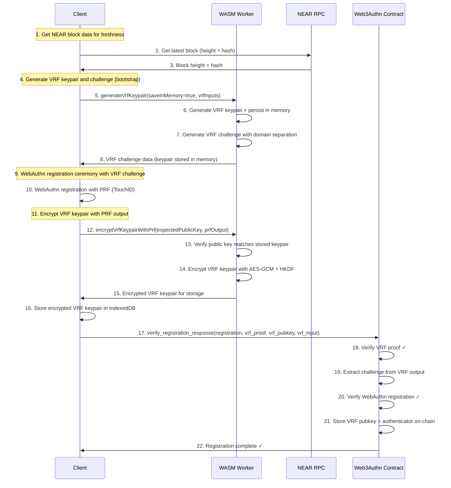
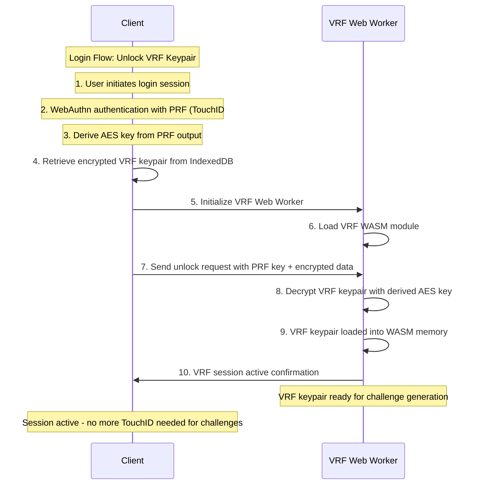
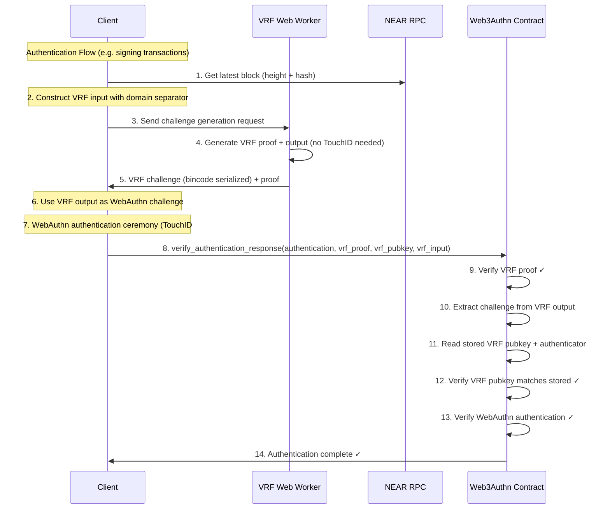

# Web3 Authn Contract

This contract implements a VRF (Verifiable Random Function) based WebAuthn protocol for serverless, stateless authentication on the blockchain.

Web3authn VRF based challenges ensures fresh, unpredictable challenges while maintaining cryptographic verifiability without server-side session state.

## Benefits
- Passkey authenticator stored onchain instead of private servers. No downtime. Access unrevokable if server goes offline.
- VRF based challenge, eliminates the need for extra server roundtrips for Webauthn authentications.
- Passkey can be used to derive embedded wallets deterministically from Passkey PRF credentials, and wallets can be recovered from onchain stored authenticators via the webauthn ceremony. Unlike other MPC-based account abstraction wallet services.
- Embedded wallet can link additional devices (additional passkeys) for redundancy and backups, or use passky sync (google and apply cloud passkey sync) to recover accidentally deleted embedded wallets.


## Getting Started

### Prerequisites

- Rust and Cargo (install from [rust-lang.org](https://www.rust-lang.org/tools/install))
- NEAR CLI:
  ```bash
  npm install -g near-cli
  ```
- cargo-near for contract deployment:
  ```bash
  cargo install cargo-near
  ```

### Environment Setup

1. Copy the example environment file:
   ```bash
   cp env.example .env
   ```

2. Configure the required environment variables in `.env`:
   - `WEBAUTHN_CONTRACT_ID`: The account ID where the contract will be deployed
   - `DEPLOYER_PUBLIC_KEY`: must be an access key on the Web3Authn contract accountId
   - `DEPLOYER_PRIVATE_KEY`: must be an access key on the Web3Authn contract accountId

### Deployment

The contract can be deployed using the provided scripts:

#### Development Deployment

For development and testing purposes:
```bash
./deploy-dev.sh
```
This builds and deploys a non-reproducible WASM binary for fast development iterations.

#### Production Deployment

For production deployment:
```bash
./deploy.sh
```
This builds and deploys a reproducible WASM binary which ensures consistent builds and contract verification on block explorers.

### Contract Upgrades

For development upgrades:
```bash
./upgrade-dev.sh
```
For production upgrades:
```bash
./upgrade.sh
```

Note: contract upgrades must ensure storage layout hasn't changed from previous deployments. If the storage layout has changed, you must run an on-chain migration (e.g. `migrate()`) or delete and re-create the contract.

## How it Works

This contract implements a dual protocol system for WebAuthn authentication:
1. **VRF Web3Authn Registration** (first-time users): One-time setup storing VRF + WebAuthn credentials
2. **VRF Web3Authn Authentication** (subsequent logins): Stateless verification using stored credentials


#### Web3Authn Account Creation Example

The contract provides a combined method for creating NEAR accounts and registering VRF WebAuthn credentials in a single contract call:

```rust
use near_workspaces::types::Gas;
use serde_json::json;

#[tokio::test]
async fn test_create_account_and_register_user() {
  // Deploy and initialize the contract
  let contract_wasm = near_workspaces::compile_project("./").await?;
  let sandbox = near_workspaces::sandbox().await?;
  let contract = sandbox.dev_deploy(&contract_wasm).await?;

  // Initialize contract with default settings
  contract.call("init")
      .args_json(json!({
          "vrf_settings": null,
          "tld_config": null
      }))
      .gas(Gas::from_tgas(100))
      .transact()
      .await?;

  // Example function call for account creation and registration
  let result = contract
      .call("create_account_and_register_user")
      .args_json(json!({
          "new_account_id": user_id,
          "new_public_key": new_public_key,
          "vrf_data": vrf_data.to_json(),
          "webauthn_registration": webauthn_registration,
          "deterministic_vrf_public_key": deterministic_vrf_public_key
      }))
      .gas(Gas::from_tgas(ACCOUNT_CREATION_GAS_LIMIT))
      .transact()
      .await?;
}
```

#### VRF Authentication

For subsequent authentications:

```rust
use near_workspaces::types::Gas;
use serde_json::json;

#[tokio::test]
async fn test_verify_authentication_response() {
  // Example function call for VRF authentication
  contract.call("verify_authentication_response")
      .args_json(json!({
          "vrf_data": {
              "vrf_input_data": vrf_data.input_data,
              "vrf_output": vrf_data.output,
              "vrf_proof": vrf_data.proof_bytes(),
              "public_key": vrf_data.pubkey_bytes(),
              "user_id": vrf_data.user_id,
              "rp_id": vrf_data.rp_id,
              "block_height": vrf_data.block_height,
              "block_hash": vrf_data.block_hash,
              "intent_digest_32": vrf_data.intent_digest_32
          },
          "webauthn_authentication": {
              "id": "credential_id",
              "rawId": raw_credential_id_bytes,
              "response": {
                  "clientDataJSON": base64_encoded_client_data,
                  "authenticatorData": base64_encoded_authenticator_data,
                  "signature": base64_encoded_signature,
                  "userHandle": null
              },
              "type": "public-key"
          }
      }))
      .gas(Gas::from_tgas(30))
      .transact()
      .await?;
}
```

The SDK provides a WASM worker which handles these web3authn contrat calls, decrypts keys, and signs transactions.


## VRF Challenge Construction

 VRF challenges are constructed using:
| Field              | Purpose                                                              | Source                    |
| ------------------ | -------------------------------------------------------------------- | ------------------------- |
| `domain_separator` | Prevents cross-protocol collisions (`"web3_authn_challenge_v3"`)     | Fixed constant            |
| `user_id`          | Binds the challenge to a user identity                               | Client session/state     |
| `relying_party_id` | Binds it to a specific origin (e.g. `"example.com"`)               | Client configuration      |
| `block_height`     | Ensures freshness and replay protection from NEAR                   | NEAR RPC call             |
| `block_hash`       | Prevents challenge reuse across forks or block reorgs               | NEAR RPC call             |
| `intent_digest_32` | Binds the 32-byte UI intent digest (canonical receiver/actions JSON; excludes nonce/block fields) | Client-side derivation |


VRF based challenge generation is required for client-side webauthn challenege generation for security reasons:
1. **Unpredictability**: VRF outputs are indistinguishable from random to attackers
2. **Verifiability**: Anyone can verify a VRF proof is valid for given input
3. **Uniqueness**: Same input always produces same output (deterministic)
4. **Non-malleability**: Cannot forge proofs without the private key
5. **Block Height Freshness**: Challenges expire with old blocks
6. **Block Hash Binding**: Prevents reuse across forks/reorgs
7. **Account Binding**: VRF public keys tied to NEAR account IDs
8. **Contract Validation**: All VRF proofs verified on-chain

## UX Flows

### Flow 1: VRF Registration (First-time users - One-time setup)

- **Registration**: One-time setup with single VRF keypair generation and encryption


Registration flow requires only **one TouchID prompt** during the entire registration process. The single VRF keypair is generated first, used for the WebAuthn challenge, then encrypted with the PRF output from that same ceremony.


**Login**: Single TouchID to unlock VRF keypair into Web Worker memory for creating VRF challeneges to use with Web3Authn. SDK provides hooks to hook this into other auth options like https://www.better-auth.com, etc.
### Flow 2: VRF Login (Session initialization - Single TouchID)



### Flow 3: VRF Authentication (Ongoing operations - Single TouchID per auth)

**Authentication**: Single TouchID per operation (VRF challenge generated automatically)

